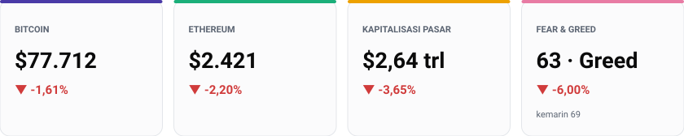
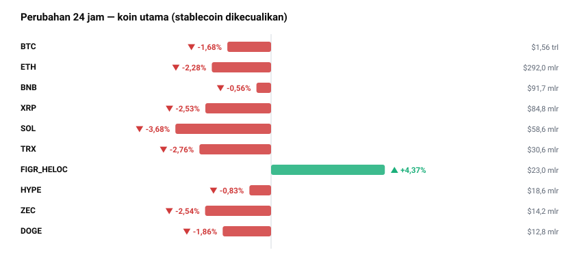
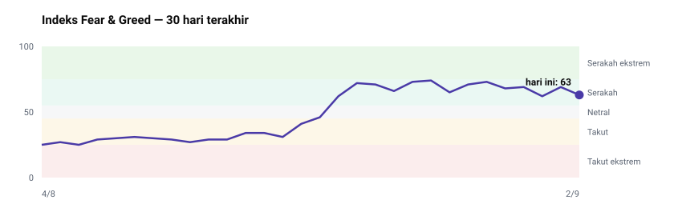
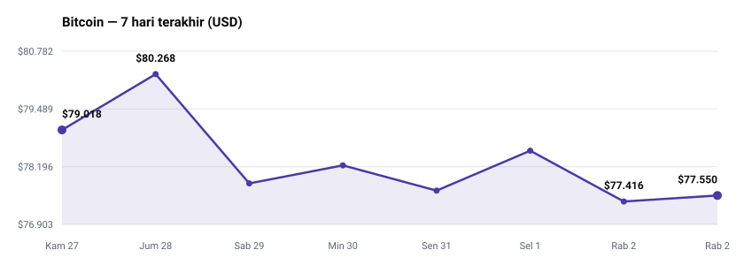
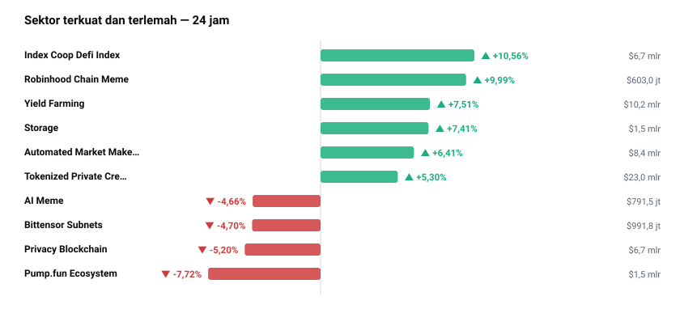
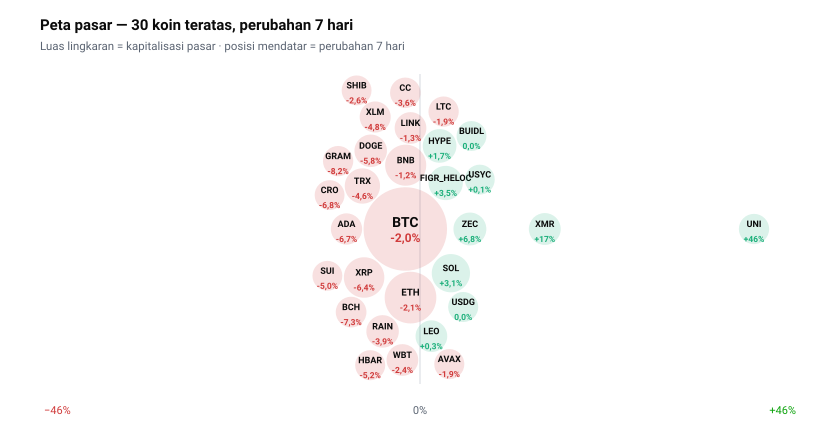

<!-- Dibuat otomatis oleh GitHub Actions pada 2026-09-02 10:57 WIB -->

# Briefing Harian — 2 September 2026

Disusun otomatis 10:57 WIB | Sumber: CoinGecko, Alternative.me, Cointelegraph, BBC World, Reddit, CryptoPanic

## Yang Paling Penting Hari Ini
Tekanan dari pasar obligasi global—ditandai oleh imbal hasil JGB Jepang tenor 10 tahun yang menembus rekor tertinggi 30 tahun—menahan laju Bitcoin di kisaran $77.550 (-1,42%) dan memicu penurunan total kapitalisasi pasar kripto sebesar -3,61% menjadi $2,63 T. Di tengah tekanan makro ini, dominasi pasar Bitcoin justru bertahan kokoh di angka 59,1%, memperlihatkan bahwa pelaku pasar memilih menarik likuiditas dari altcoin berisiko tinggi dan mengamankannya ke Bitcoin. Fenomena ini dipilih sebagai tulang punggung laporan hari ini karena menjadi indikator kunci: rotasi modal saat ini bukan bentuk aksi jual panik ke mata uang fiat, melainkan konsolidasi likuiditas ke aset kripto yang paling berdaya tahan. Kalau yield obligasi global terus merangkak naik, maka alokasi modal pada altcoin diperkirakan akan makin tertekan dalam jangka pendek—sebuah spekulasi yang perlu diantisipasi pemegang portofolio altcoin.

## Pasar Crypto

| Aset | Harga | 24 Jam | Kapitalisasi Pasar |
| --- | --- | --- | --- |
| BTC | $77.550 | -1,42% | $1,56 T |
| ETH | $2.413 | -2,37% | $291,2 M |
| USDT | $0,9996 | -0,01% | $183,3 M |
| BNB | $687,30 | -0,86% | $91,5 M |
| XRP | $1,35 | -2,65% | $84,7 M |
| USDC | $0,9998 | -0,01% | $73,6 M |
| SOL | $100,16 | -3,36% | $58,6 M |
| TRX | $0,3216 | -3,18% | $608,9 jt |

Di antara delapan aset teratas, Solana (SOL) dan TRON (TRX) mencatatkan penurunan tertekan masing-masing sebesar -3,36% dan -3,18% dalam 24 jam terakhir. Koreksi ini selaras dengan tren pelemahan aset berkapitalisasi besar di luar Bitcoin. Namun, pergerakan berbeda terlihat pada beberapa token di luar tabel utama, seperti Filecoin (FIL) yang melonjak +15,83% dan Uniswap (UNI) yang naik +11,79% dalam kurun waktu 24 jam yang sama, dipicu oleh dorongan aktivitas spesifik pada ekosistem masing-masing.

Dominasi Bitcoin tercatat menguat hingga 59,1%, sementara dominasi Ethereum tertahan di angka 11,1%. Ketimpangan ini menunjukkan bahwa Ethereum belum mampu mengambil alih kepemimpinan pasar, dan altcoin secara umum masih berada dalam posisi rentan terhadap Bitcoin.

Volume perdagangan pasar secara keseluruhan dalam 24 jam berada di angka $84,4 M. Nilai volume ini relatif sedang jika dibandingkan dengan kapitalisasi pasar sebesar $2,63 T, yang mengindikasikan bahwa penurunan harga harian lebih disebabkan oleh sepinya dorongan pembeli baru daripada gelombang penjualan besar-besaran.

## Sentimen Pasar

Indeks Fear & Greed hari ini mencatatkan angka 63 (berada dalam kategori Greed), mengalami penurunan dibanding posisi kemarin di angka 69 (Greed) dan sepekan lalu di angka 65 (Greed).

Penurunan sentimen sebanyak 6 poin dari hari sebelumnya mencerminkan sikap hati-hati para pelaku pasar seiring dengan penurunan harga Bitcoin sebesar -1,86% dalam 7 hari terakhir (bergerak dari $79.018 ke $77.550 — hitungan saya sendiri dari deret harga harian CoinGecko).

Menariknya, meskipun sentimen umum melemah dan Bitcoin terkoreksi tipis, beberapa koin seperti Uniswap (UNI) dan Arbitrum (ARB) justru mencatatkan kenaikan mingguan masing-masing +38,70% dan +18,90%. Adanya pergerakan berlawanan antara indeks sentimen utama yang melandai dengan penguatan tajam pada koin aplikasi terdesentralisasi memberikan sinyal bahwa kewaspadaan makro tidak menghentikan perburuan imbal hasil secara selektif di sektor ekosistem terbelakang (Layer-2 dan DeFi).

## Berita & Kebijakan Penting
* **Konsorsium 21 Lembaga Keuangan (BofA, Citi, Goldman Sachs) Berencana Rilis Stablecoin**: Konsorsium perbankan global sedang mempersiapkan peluncuran stablecoin berpatok Dolar AS sebelum memperluasnya ke mata uang G7 lainnya seperti Euro.
  Kenapa penting: Inisiatif ini menandakan masuknya perbankan TradFi secara langsung ke infrastruktur likuiditas digital, yang berpotensi menantang dominasi penerbit swasta seperti Tether dan Circle.
* **Binance Luncurkan Opsi 1.000 Saham dan ETF AS**: Bursa Binance memperluas layanan bagi pengguna non-AS dengan menyediakan perdagangan opsi yang diselesaikan secara fisik untuk lebih dari 1.000 saham dan ETF AS melalui satu akun.
  Kenapa penting: Langkah ini semakin mengikis batas antara bursa kripto dan pasar modal tradisional, mempermudah arus modal lintas aset bagi investor internasional.
* **SEC Usulkan Pembaruan Aturan Transfer Agent Berbasis Blockchain**: SEC AS mengajukan modernisasi aturan transfer agent yang belum diperbarui sejak 1980-an untuk mengakomodasi pencatatan rekor berbasis blockchain dan sekuritas ter-tokenisasi.
  Kenapa penting: Regulasi ini memberikan kepastian hukum yang dibutuhkan institusi untuk memperluas tokenisasi aset dunia nyata (RWA) secara sah.
* **Ethena Rilis Aplikasi Pembayaran USDe Berimbal Hasil 6%**: Ethena meluncurkan aplikasi pembayaran mandiri (self-custodial) berbasis USDe untuk transaksi harian dan transfer lintas negara dengan imbal hasil hingga 6% per tahun.
  Kenapa penting: Upaya ini mendorong adopsi praktis stablecoin sintetis ke sektor riil sekaligus menawarkan alternatif imbal hasil pasif di tengah tren bunga rendah.
* **Otoritas Inggris Bekukan $13,5 Juta Terkait Penyelidikan Sponsor Premier League**: Pihak berwenang Inggris membekukan dana $13,5 juta dalam investigasi terhadap Sorare menyusul perintah pengadilan.
  Kenapa penting: Tindakan ini menegaskan tingginya risiko hukum dan pengawasan ketat terhadap kesepakatan sponsorship antara perusahaan kripto dan organisasi olahraga besar.

## Rotasi Sektor

Data 24 jam menunjukkan bahwa sektor Robinhood Chain Meme (+10,13%), Curve Ecosystem (+8,70%), dan Index Coop Defi Index (+7,42%) mencatatkan penguatan tertinggi. Sebaliknya, sektor BackedFi xStocks Ecosystem (-11,30%) dan Pump.fun Ecosystem (-7,75%) mengalami penurunan terdalam. Angka-angka ini memperlihatkan adanya pergeseran modal dari platform pembuat memecoin dan saham ter-tokenisasi menuju ekosistem DeFi teregulasi serta protokol pertukaran terdesentralisasi.

## Yang Sedang Ramai Dibicarakan
Di platform CoinGecko dan forum diskusi Reddit, perhatian ritel tertuju pada koin seperti Pons (PONS), Arbitrum (ARB), Uniswap (UNI), dan Solana (SOL), di samping isu teknis migrasi jaringan Arbitrum Nova serta aksi korporasi MicroStrategy. Komunitas ritel juga menyoroti integrasi pembelian memecoin menggunakan kartu kredit pada dompet digital. Perhatian yang tinggi pada topik-topik ini wajib dipahami murni sebagai indikator tingkat popularitas dan keramaian ritel saat ini, BUKAN sebagai indikator kualitas fundamental atau keamanan aset.

## Kandidat untuk Diteliti

* **UNI (Uniswap)** — Naik +38,70% dalam sepekan dan +11,79% dalam 24 jam dengan rasio volume terhadap kapitalisasi pasar sebesar 28,1% (volume $1,04 M pada kapitalisasi $3,7 M — hitungan saya sendiri dari data di atas). Alasan mikro: Terjadi peningkatan volume akumulasi yang signifikan pada ekosistem bursa terdesentralisasi ini. Alasan makro: Rotasi modal yang mengalir kuat ke sektor DeFi saat harga pasar kripto utama cenderung konsolidasi.
* **XMR (Monero)** — Mencatatkan kenaikan +16,10% dalam 7 hari namun terkoreksi tipis -0,70% dalam 24 jam terakhir. Alasan mikro: Mengalami konsolidasi teknis atau jeda sejenak setelah reli beruntun sepanjang pekan. Alasan makro: Narasi kebutuhan privasi transaksi keuangan tetap mendapatkan alokasi modal yang konsisten di tengah penguatan regulasi.
* **ENA (Ethena)** — Volume transaksi 24 jam mencapai rasio tinggi 52,3% dari kapitalisasi pasarnya ($1,6 M). Alasan mikro: Peluncuran aplikasi pembayaran USDe baru berimbal hasil 6% menjadi pemicu utama lonjakan aktivitas transaksi. Alasan makro: Tingginya minat pasar terhadap instrumen penghasil imbal hasil (yield-bearing asset) di tengah stagnasi aset utama.
* **ARB (Arbitrum)** — Volume harian mencapai rasio 47,7% dari kapitalisasi pasar ($751,3 jt) dengan penguatan mingguan +18,90%. Alasan mikro: Penyesuaian operasional jaringan Arbitrum Nova dan migrasi token Moons menyedot aktivitas pengguna. Alasan makro: Sentimen positif yang terus menopang infrastruktur skalabilitas Layer-2 Ethereum.
* **VET (VeChain)** — Menguat +15,20% dalam 7 hari tetapi terkoreksi -1,76% dalam 24 jam. Alasan mikro: pemicunya belum diketahui dari data hari ini. Alasan makro: Pembalikan alokasi mingguan ke aset rantai pasok dan enterprise blockchain.

Ini hasil pemindaian angka, bukan rekomendasi. Sinyal di sini baru layak ditindaklanjuti setelah dibedah mendalam — suplai, unlock, pendana, dan whitepaper-nya.

## Sisi Lain
Tesis utama laporan ini menyatakan bahwa pasar sedang berada dalam fase konsolidasi yang relatif stabil, di mana likuiditas bertengger di Bitcoin dan terdistribusi secara tertata ke sektor DeFi/Layer-2. Namun, argumen tandingannya memamparkan risiko makro yang serius: lonjakan imbal hasil obligasi pemerintah Jepang (JGB) hingga rekor 30 tahun beserta kenaikan yield global adalah ancaman nyata bagi seluruh aset berisiko. Kalau imbal hasil obligasi bebas risiko terus meningkat, modal institusional berpotensi keluar dari pasar kripto secara masif menuju pasar uang tradisional. Jika skenario peleburan likuiditas makro ini terjadi, pertahanan Bitcoin di $77.550 berisiko jebol, dan penguatan pada sektor altcoin seperti UNI dan ARB dapat terhapus dengan cepat.

## Agenda yang Perlu Diperhatikan
* Keputusan final konsorsium 21 bank (BofA, Citi, Goldman Sachs) terkait tanggal peluncuran stablecoin USD (perkiraan).
* Pelaksanaan teknis migrasi token Moons pada jaringan Arbitrum Nova (perkiraan).
* Perkembangan resmi usulan pembaruan aturan transfer agent berbasis blockchain oleh SEC AS (perkiraan).
* Keputusan rapat evaluasi MSCI mengenai aturan kelayakan indeks terhadap perusahaan penyimpan Bitcoin (perkiraan).

## Catatan & Batas Laporan Ini
Data berita internasional dari BBC World tidak tersedia dalam pemindaian sistem hari ini, sehingga analisis keterkaitan geopolitik luar negeri terbatas pada data obligasi makro yang ada. Laporan ini tidak memprediksi arah harga jarak pendek (intraday) dan tidak memvalidasi ketahanan fundamental jangka panjang dari koin-koin yang mengalami lonjakan volume harian. Laporan ini menyajikan situasi, bukan nasihat investasi.
