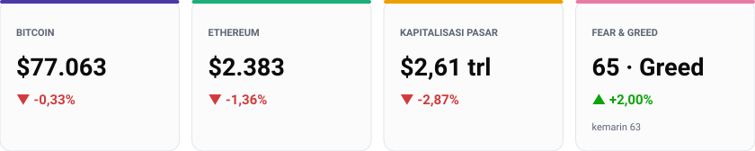
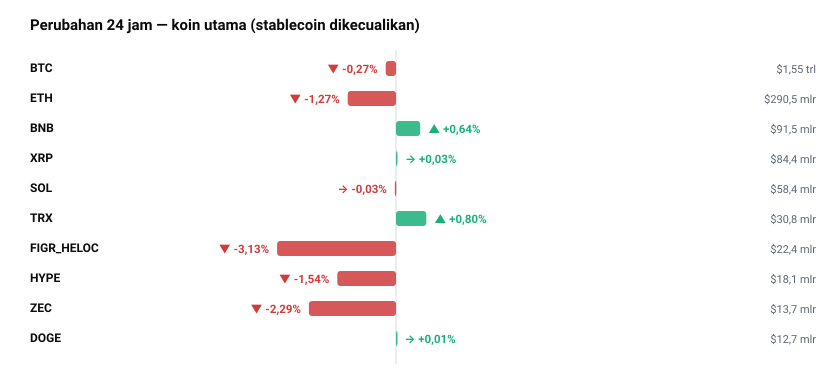
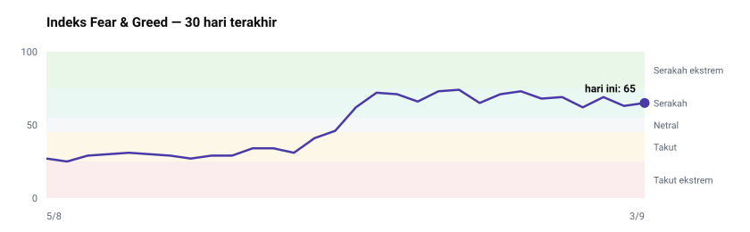
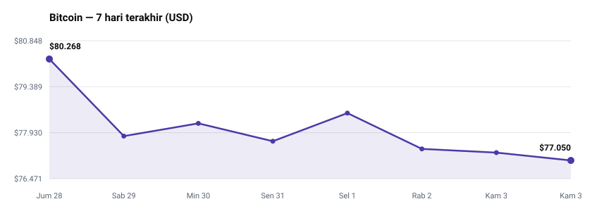
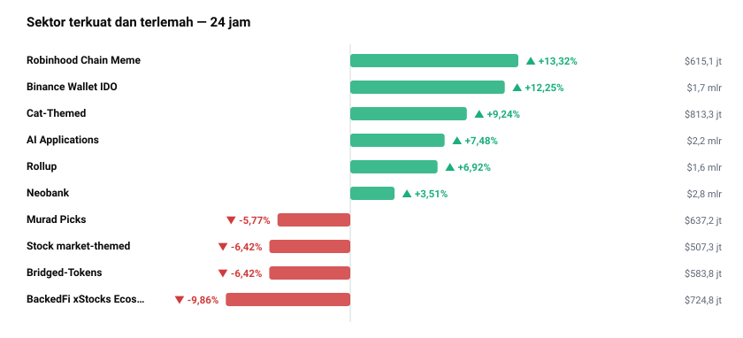
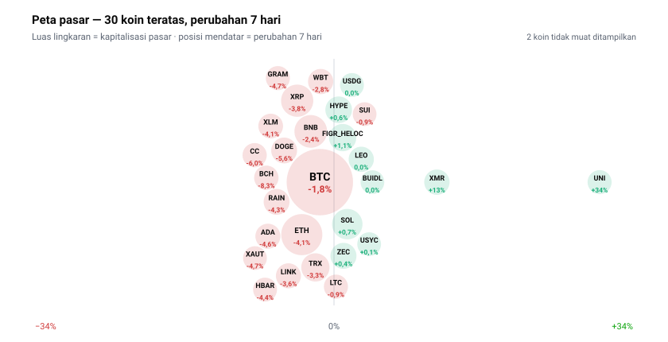

<!-- Dibuat otomatis oleh GitHub Actions pada 2026-09-03 07:33 WIB -->

# Briefing Harian — 3 September 2026

Disusun otomatis 07:33 WIB | 1 USD = Rp17.715 (Frankfurter)

## Yang Paling Penting Hari Ini
Bitcoin tertekan ke level $77.025, turun -4,04% dalam tujuh hari terakhir dan menyentuh titik terendahnya sepekan ini — hitungan saya dari deret harga CoinGecko — di tengah indikator permintaan terwujud (*apparent demand*) yang kembali negatif. Penurunan ini menyeret total kapitalisasi pasar crypto global memerah -2,95% menjadi $2,61 triliun dalam 24 jam terakhir. Fenomena ini menjadi tulang punggung pergerakan hari ini karena stagnasi dan penyusutan arus kas pada Bitcoin sebagai aset acuan membendung reli pasar secara keseluruhan, meskipun terjadi retensi modal secara selektif pada ekosistem Layer-2 dan DeFi.

## Pasar Crypto

| Aset | Harga | 24 Jam | Kapitalisasi Pasar |
| --- | --- | --- | --- |
| BTC | $77.025 | -0,34% | $1,55 triliun |
| ETH | $2.380 | -1,38% | $290,4 miliar |
| USDT | $0,9997 | +0,01% | $183,3 miliar |
| BNB | $687,28 | +0,55% | $91,5 miliar |
| XRP | $1,35 | -0,09% | $84,4 miliar |
| USDC | $0,9998 | +0,00% | $73,7 miliar |
| SOL | $99,70 | -0,17% | $58,4 miliar |
| TRX | $0,3246 | +0,74% | $30,8 miliar |

Pergerakan terparah di jajaran kapitalisasi besar dialami oleh Figure Heloc (FIGR_HELOC) yang terkoreksi -3,13% ke $1,01 dan Zcash (ZEC) yang melemah -2,28% ke $811,52 dalam 24 jam terakhir. Di sisi lain, TRON (TRX) memimpin kenaikan di papan atas dengan menguat +0,74% ke $0,3246. Koreksi pada mayoritas aset utama mencerminkan kehati-hatian pelaku pasar saat obligasi dan pasar saham global juga mengalami penurunan.

Dominasi pasar Bitcoin saat ini berada di angka 59,0%, sedangkan Ethereum mencatatkan dominasi 11,1%. Tingginya dominasi Bitcoin yang mendekati 60% menunjukkan bahwa altcoin secara umum belum memiliki daya dorong independen yang cukup kuat untuk memulai rotasi modal berskala besar. Kalau dominasi BTC terus menanjak menembus 60%, maka altcoin berisiko mengalami tekanan likuiditas yang lebih dalam.

Volume transaksi global 24 jam tercatat sebesar $73,5 miliar, dengan partisipasi terbesar berada pada stablecoin USDT ($47,1 miliar) dan Bitcoin ($26,4 miliar). Rasio volume terhadap kapitalisasi pasar Bitcoin berada di kisaran 1,7% — hitungan saya dari data kapitalisasi $1,55 triliun dan volume $26,4 miliar — yang mengindikasikan bahwa aktivitas perdagangan pasar secara umum cenderung tertahan dan didominasi oleh transaksi lindung nilai.

## Sentimen Pasar

Indeks Fear & Greed hari ini mencatatkan angka 65 (Greed), naik tipis dari posisi kemarin sebesar 63 (Greed), namun turun dibandingkan sepekan lalu yang berada di level 71 (Greed).

Pergerakan indeks sentimen ini menunjukkan dinamika yang berlawanan (*divergence*) dengan harga Bitcoin yang justru melemah -4,04% dalam tujuh hari terakhir dari $80.268 ke $77.025. Ketika sentimen ritel tetap berada di zona serakah padahal harga aset acuan terus merosot, kondisi ini mengindikasikan adanya celah ekspektasi (*expectation gap*) yang rentan memicu pemicuan aksi jual kejutan (*flush-out*) kalau harga menembus level dukungan krusial.

## Berita & Kebijakan Penting
* Coinbase resmi meluncurkan produk derivatif crypto berjangka teratur (*regulated derivatives*) di Kanada dengan opsi *leverage* hingga 10x bagi investor yang memenuhi syarat.
Kenapa penting: Langkah ini memperluas jangkauan kelembagaan platform perdagangan AS ke pasar Kanada di tengah ketidakpastian regulasi domestik.
* Pemerintah Negara Bagian Wyoming mengintegrasikan verifikasi cadangan waktu-nyata berbasis Chainlink untuk stable token milik negara (FRNT).
Kenapa penting: Integrasi ini memperkuat adopsi teknologi *oracle* dalam aset tertokenisasi publik dan meningkatkan standar transparansi cadangan obligasi atau kas.
* Ondo mendesak SEC dan CFTC AS untuk mengizinkan perdagangan berjangka perpetual (*perpetual futures*) saham AS secara domestik di dalam negeri.
Kenapa penting: Inisiatif ini berpotensi membuka kerangka hukum baru yang menjembatani derivatif keuangan tradisional dengan ekosistem DeFi berbasis sekuritas tertokenisasi.
* Otoritas federal AS bekerja sama dengan CrowdStrike berhasil melumpuhkan *malware* yang bertanggung jawab atas pencurian crypto senilai $150.000 selama delapan tahun terakhir.
Kenapa penting: Penindakan ini menegaskan fokus penegak hukum global terhadap infrastruktur keamanan cyber yang menyasar ekosistem aset digital.
* G20 di bawah presidensi AS mengonfirmasi adanya jalur jelas (*clear pathways*) bagi inovasi aset digital untuk mendukung pertumbuhan ekonomi serta perbaikan transaksi lintas batas.
Kenapa penting: Pernyataan kolektif ini memberikan arah kebijakan makro global yang positif bagi adopsi institusional.

## Rotasi Sektor

Sektor Robinhood Chain Meme (+13,32%), Binance Wallet IDO (+12,25%), dan Cat-Themed (+9,24%) mencatatkan penguatan tertinggi dalam 24 jam terakhir. Di sisi sebaliknya, sektor BackedFi xStocks Ecosystem (-9,86%) serta sektor *Bridged-Tokens* (-6,42%) mengalami pelemahan paling dalam. Data ini mengindikasikan pergeseran modal jangka pendek yang keluar dari derivatif saham tertokenisasi menuju spekulasi ceruk serta ekosistem peluncuran token baru.

## Yang Sedang Ramai Dibicarakan
Perbincangan ritel di saluran Reddit r/CryptoCurrency dan daftar trending CoinGecko saat ini didominasi oleh perdebatan mengenai migrasi jaringan Arbitrum Nova yang mewajibkan penjembatanan (*bridging*) token Moons, kasus pemblokiran penarikan akun Kraken akibat *wallet address poisoning*, serta pernyataan Arthur Hayes yang lebih memilih Ethereum ketimbang Bitcoin. Perhatian ini harus diperlakukan secara eksplisit sebagai indikator perhatian ritel semata, BUKAN sebagai indikator kualitas teknis atau fundamental dari aset tersebut.

## Kandidat untuk Diteliti

* **UNI (Uniswap)** — naik +33,80% sepekan dan +49,60% sebulan, meski terkoreksi -1,53% dalam 24 jam terakhir. Koreksi tipis ini mencerminkan tarikan napas teknis di tengah tren naik jangka menengah yang kuat. Kondisi ini didukung oleh bertahannya volume perdagangan protokol pertukaran terdesentralisasi di tengah volatilitas pasar.
* **ARB (Arbitrum)** — melonjak +37,00% dalam sepekan dengan rasio volume 24 jam terhadap kapitalisasi pasar mencapai 42,6%. Secara mikro, lonjakan aktivitas ini terjadi bersamaan dengan pengumuman restrukturisasi jaringan Arbitrum Nova. Secara makro, sektor *Rollup* menguat +6,92% dalam 24 jam, mempertegas arus modal ke solusi Layer-2.
* **CRV (Curve DAO)** — mencatatkan kenaikan +15,50% dalam 7 hari dan +76,40% dalam 30 hari, meski turun -3,26% hari ini. Penguatan bulanan yang signifikan ini menunjukkan pemulihan struktur akumulasi pada protokol likuiditas DeFi. Secara makro, tren sentimen positif pada sektor infrastruktur DeFi menopang daya tahan harganya.
* **USDG (Global Dollar)** — mencatatkan volume transaksi 24 jam setara 53% dari total kapitalisasi pasarnya. Pemicu mikronya belum diketahui dari data hari ini. Secara makro, lonjakan volume pada stablecoin biasanya menandakan persiapan pergeseran modal besar atau kebutuhan likuiditas mendesak di platform perdagangan.

Ini hasil pemindaian angka, bukan rekomendasi. Sinyal di sini baru layak ditindaklanjuti setelah dibedah mendalam — suplai, unlock, pendana, dan whitepaper-nya.

## Sisi Lain
Meskipun narasi koreksi Bitcoin terdorong oleh penurunan permintaan terwujud dan tekanan makro pasar saham, pembacaan bearish ini memiliki celah pelemahan. Penguatan signifikan pada sektor Rollup (+6,92%) serta lonjakan harga aset seperti ARB (+37,00% sepekan) dan UNI (+33,80% sepekan) menunjukkan bahwa modal tidak sepenuhnya keluar dari pasar, melainkan melakukan rotasi internal ke sektor utilitas. Kalau permintaan aset Layer-2 dan DeFi ini berhasil mempertahankan likuiditas ekosistem, maka tekanan pada Bitcoin berisiko tertahan dan bisa memicu pemulihan harga yang cepat (*bullish reversal*).

## Agenda yang Perlu Diperhatikan
* Evaluasi lanjutan kebijakan suku bunga bank sentral global pasca-pernyataan G20 terkait aset digital (perkiraan).
* Tanggapan Mahkamah Agung AS atas petisi otoritas New Jersey terkait perdagangan kontrak prediksi Kalshi (perkiraan).
* Proses penghentian operasional (*wind down*) protokol Full Sail pada jaringan Sui pasca-insiden keamanan oracle Switchboard.
* Batas waktu penjembatanan (*bridging*) token Moons akibat migrasi jaringan Arbitrum Nova (perkiraan).

## Catatan & Batas Laporan Ini
Data berita internasional umum dan beberapa poin sorotan komunitas tidak tersedia dalam rilis data hari ini. Laporan ini tidak memuat jadwal pembukaan kunci token dan data pendanaan proyek, karena sumber gratisnya sudah tidak tersedia — keduanya perlu ditelusuri manual. Laporan ini menyajikan situasi, bukan nasihat investasi.
