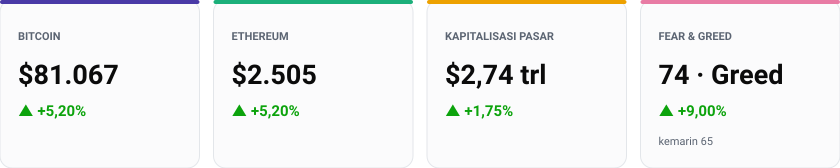
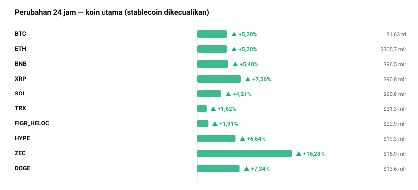
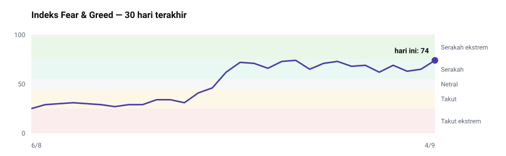
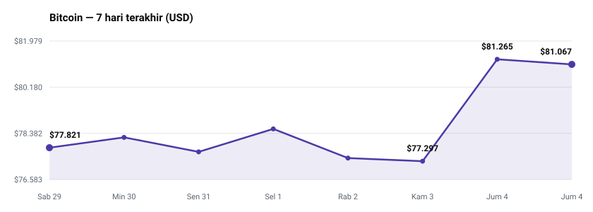
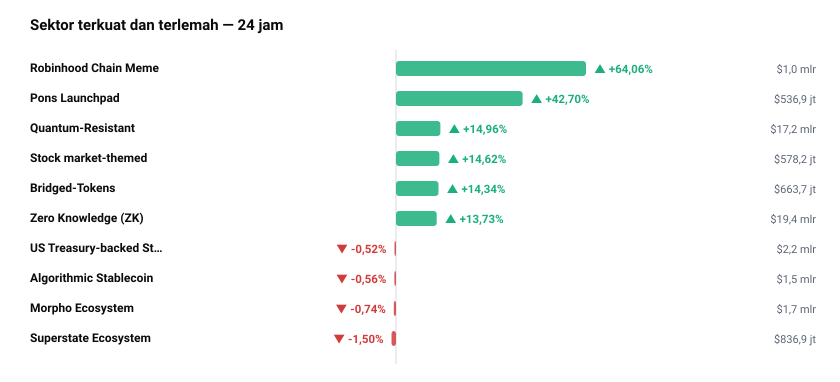
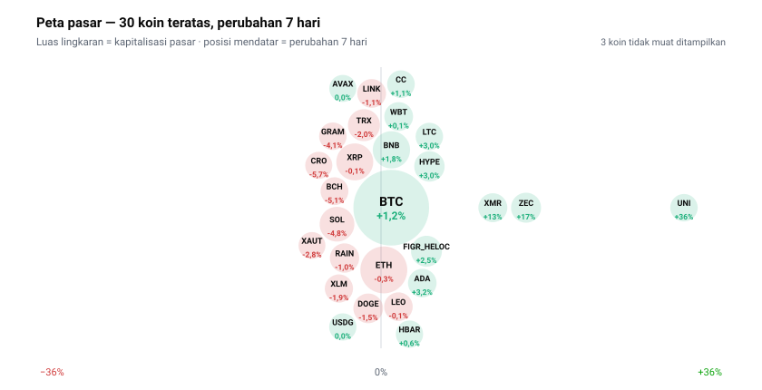

<!-- Dibuat otomatis oleh GitHub Actions pada 2026-09-04 07:55 WIB -->

# Briefing Harian — 4 September 2026

Disusun otomatis 07:55 WIB | 1 USD = Rp17.647 (Frankfurter)

## Yang Paling Penting Hari Ini
Bitcoin berhasil menembus level $81.067 (+5,20% dalam 24 jam) dan mendorong total kapitalisasi pasar kripto global naik menjadi $2,74 triliun. Lonjakan ini dipicu oleh pelemahan Indeks Dolar AS (DXY) di tengah dugaan intervensi mata uang yen oleh Bank of Japan. Pergerakan makro pada mata uang fiat ini menjadi pendorong utama pasar hari ini karena memicu arus masuk likuiditas secara serentak ke aset-aset utama, melampaui dampak dari sentimen individual masing-masing altcoin.

## Pasar Crypto

| Aset | Harga | 24 Jam | Kapitalisasi Pasar |
| --- | --- | --- | --- |
| BTC | $81.067 | +5,20% | $1,63 triliun |
| ETH | $2.505 | +5,20% | $305,7 miliar |
| USDT | $1,00 | +0,03% | $183,4 miliar |
| BNB | $724,48 | +5,40% | $96,5 miliar |
| XRP | $1,45 | +7,56% | $90,8 miliar |
| USDC | $1,0000 | +0,01% | $74,4 miliar |
| SOL | $103,78 | +4,21% | $60,8 miliar |
| TRX | $0,3302 | +1,62% | $31,3 miliar |

Di jajaran aset berkapitalisasi besar, Zcash (ZEC) mencatatkan kenaikan terkuat dengan melesat +16,28% ke harga $941,29 dan volume harian mencapai $1,0 miliar, diikuti XRP yang naik +7,56% ke $1,45. Penguatan ini berjalan sejajar dengan kenaikan Bitcoin dan Ethereum yang sama-sama tumbuh +5,20% dalam 24 jam terakhir.

Dominasi pasar Bitcoin saat ini berada di angka 59,4%, sementara Ethereum berada di 11,1%. Tingginya porsi dominasi Bitcoin mengindikasikan bahwa arus modal utama masih menumpuk di aset acuan. Kalau dominasi BTC mulai melandai dari kisaran 59,4% sementara volume harian pasar bertahan kuat, maka potensi pergeseran likuiditas ke altcoin lapis kedua dapat terbuka lebih lebar.

Total volume perdagangan 24 jam di pasar global tercatat sebesar $107,4 miliar. Tingginya angka transaksi yang mengiringi kenaikan kapitalisasi pasar sebesar +1,75% menandakan bahwa pergerakan harga hari ini ditopang oleh volume akumulasi riil di pasar spot, bukan sekadar dorongan transaksi berjangka yang tipis.

## Sentimen Pasar

Indeks Fear & Greed berada di level 74 (Greed) hari ini, menguat signifikan dibanding posisi kemarin di angka 65 (Greed) dan berada sedikit di atas posisi sepekan lalu di angka 73 (Greed). Kenaikan semalam mencerminkan respons langsung para pelaku pasar terhadap penembusan harga Bitcoin ke atas level $80.000.

Pergerakan indeks sentimen ini searah dengan laju harga Bitcoin yang menguat +4,17% dalam 7 hari terakhir — bergeser dari $77.821 ke $81.067 (hitungan saya dari deret harga harian CoinGecko). Keselarasan antara kenaikan sentimen dan kenaikan harga menunjukkan bahwa pasar bergerak atas dasar dorongan tren, bukan divergensi spekulatif.

Namun, posisi indeks yang mendekati batas *extreme greed* menuntut kecermatan. Kalau harga Bitcoin gagal mempertahankan penembusan di atas puncak mingguan $81.265, maka sentimen yang terakselerasi cepat ini berisiko memicu aksi ambil untung sensitif dari para pedagang harian.

## Berita & Kebijakan Penting
* Bitcoin merebut kembali level $80.000 (kini $81.067) beriringan dengan melemahnya DXY akibat dugaan intervensi Bank of Japan di pasar valuta asing.
  Kenapa penting: Pelemahan DXY secara historis membuka keran likuiditas global yang menguntungkan aset berisiko seperti kripto.
* CFTC mengajukan permohonan pembatalan atas gugatan CME Group terkait produk berjangka abadi (*perpetual futures*) kripto.
  Kenapa penting: Langkah regulasi ini berpotensi meredakan ketidakpastian hukum atas instrumen turunan kripto yang diperdagangkan secara luas di bursa AS.
* Jaringan Mantle mengintegrasikan *stablecoin* USDG terbitan Paxos serta bergabung ke dalam jaringan pembagian imbal hasil Global Dollar Network.
  Kenapa penting: Keputusan ini memperkuat persaingan antar-jaringan layer-2 dalam menggaet likuiditas *stablecoin* berbasis imbal hasil (*yield*).
* Kraken (Payward) menjalin kemitraan dengan SoFi untuk integrasi SoFiUSD dan penyelesaian transaksi 24/7 melalui Kraken Prime.
  Kenapa penting: Integrasi ini memperpendek jarak antara infrastruktur perbankan konsumen AS dan likuiditas bursa kripto utama.
* Dubai Financial Services Authority melalui VARA menandatangani MoU dengan Securitize untuk memacu inovasi sekuritas tertokenisasi.
  Kenapa penting: Kepastian kerangka kerja ini memperjelas regulasi penerbitan aset dunia nyata (*real-world assets*) di kawasan Timur Tengah.

## Rotasi Sektor

Sektor Robinhood Chain Meme (+64,06%) dan Pons Launchpad (+42,70%) memimpin penguatan sektor teratas dalam 24 jam terakhir, diikuti oleh sektor Quantum-Resistant (+14,96%) dan Zero Knowledge (+13,73%). Sebaliknya, sektor Superstate Ecosystem (-1,50%) dan Morpho Ecosystem (-0,74%) menjadi yang paling tertekan. Angka-angka ini menunjukkan bahwa arus kas harian terbagi antara dorongan spekulasi ritel pada *launchpad* spesifik dan akumulasi pada sektor infrastruktur kriptografi.

## Yang Sedang Ramai Dibicarakan
Daftar koin trending saat ini didominasi oleh Pons (PONS), Lil' Shrub (SHRUB), Lighter (LIT), Zcash (ZEC), dan Uniswap (UNI). Di komunitas Reddit r/CryptoCurrency, fokus percakapan tertuju pada Bitcoin yang berhasil melampaui $80.000, rencana Arbitrum untuk merestrukturisasi jaringan Arbitrum Nova yang mewajibkan penjembatanan (*bridging*) token Moons, serta pengamatan anggota komunitas atas menyusutnya cadangan *stablecoin* di bursa. Perlu ditegaskan secara eksplisit bahwa tingginya popularitas di media sosial ini adalah indikator perhatian ritel semata, BUKAN indikator kualitas fundamental aset.

## Kandidat untuk Diteliti

* **UNI (Uniswap)** — Menguat +35,50% dalam sepekan dan +63,50% dalam sebulan dengan kenaikan 24 jam sebesar +9,50%. Alasan mikro: pemicu spesifik dari dalam proyek belum diketahui dari data hari ini. Alasan makro: terdorong oleh rotasi likuiditas ke token protokol bursa terdesentralisasi saat volume transaksi spot global melonjak.
* **ARB (Arbitrum)** — Volume harian mencapai 51,0% dari total kapitalisasi pasarnya ($973,8 juta), menguat +52,20% dalam 7 hari. Alasan mikro: dipicu oleh pengumuman restrukturisasi jaringan Arbitrum Nova yang mengharuskan pemegang token melakukan penjembatanan. Alasan makro: terangkat oleh arus masuk modal ke sektor Zero Knowledge (+13,73%) dan ekosistem pemrosesan transaksi skala besar.
* **ENA (Ethena)** — Rasio volume 24 jam terhadap kapitalisasi pasar mencapai 54%, menandakan pemusatan aktivitas transaksi harian. Alasan mikro: pemicu internal belum diketahui dari data hari ini. Alasan makro: didukung oleh tingginya minting dan permintaan likuiditas *stablecoin* berbasis imbal hasil di tengah tren pasar yang membaik.
* **TRUMP (Official Trump)** — Volume 24 jam mencapai 79% dari kapitalisasi pasarnya ($613,1 juta) meski harga sepekan masih terkoreksi -6,10%. Alasan mikro: pemicu lonjakan transaksi mendadak belum diketahui dari data hari ini. Alasan makro: sangat sensitif terhadap berita politik dan sentimen momentum jangka pendek ritel.

Ini hasil pemindaian angka, bukan rekomendasi. Sinyal di sini baru layak ditindaklanjuti setelah dibedah mendalam — suplai, unlock, pendana, dan whitepaper-nya.

## Sisi Lain
Meskipun kenaikan harga ke $81.067 tergolong kuat, dasar pembacaan bullish ini sangat bergantung pada keberlanjutan pelemahan dolar AS akibat dugaan intervensi Bank of Japan. Apabila efek intervensi valuta asing tersebut memudar dan Indeks DXY kembali menguat, dorongan likuiditas makro dapat berbalik dengan cepat. Selain itu, sorotan komunitas mengenai menyusutnya cadangan *stablecoin* di bursa mengindikasikan bahwa pasokan modal siap pakai (*dry powder*) untuk mengejar harga di tingkat ini makin terbatas, yang berisiko memicu koreksi jika pembeli spot menahan diri.

## Agenda yang Perlu Diperhatikan
* Pemantauan kelanjutan intervensi Bank of Japan dan dampaknya terhadap Indeks DXY (perkiraan).
* Tenggat kepatuhan dan pembaruan lisensi bagi firma kripto di Australia (perkiraan).
* Pelaksanaan penjembatanan (*bridging*) token Moons seiring restrukturisasi jaringan Arbitrum Nova (perkiraan).
* Perkembangan keputusan Supreme Court terkait gugatan pembatasan Kalshi di Michigan (perkiraan).

## Catatan & Batas Laporan Ini
Data berita umumBBC World dan sorotan komunitas CryptoPanic tidak tersedia pada pemindaian hari ini, sehingga analisis keterkaitan geopolitik luar pasar kripto tidak dapat disajikan. Laporan ini juga tidak memuat jadwal pembukaan kunci token dan data pendanaan proyek, karena sumber gratisnya sudah tidak tersedia — keduanya perlu ditelusuri manual. Laporan ini menyajikan situasi, bukan nasihat investasi.
