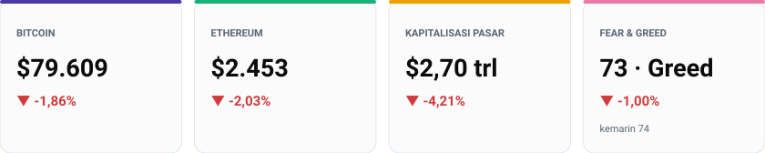
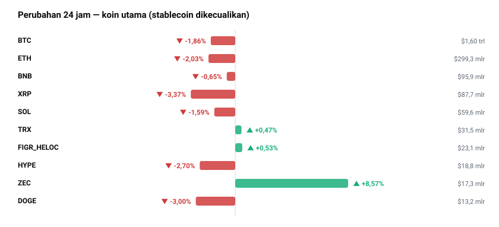
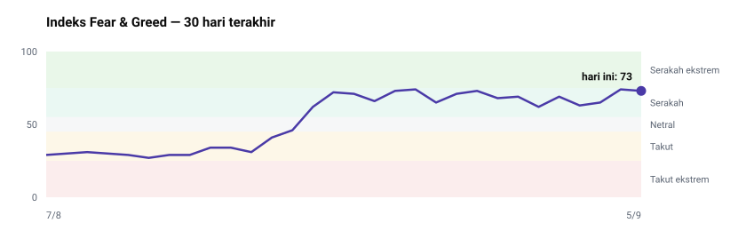
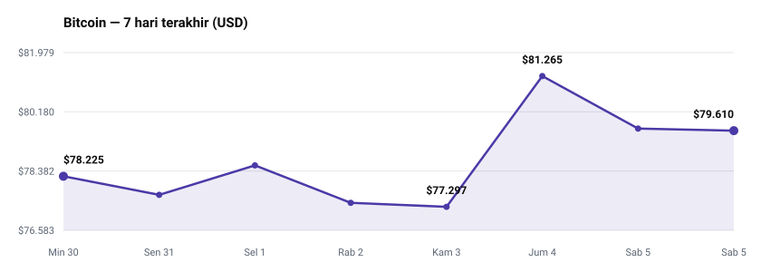
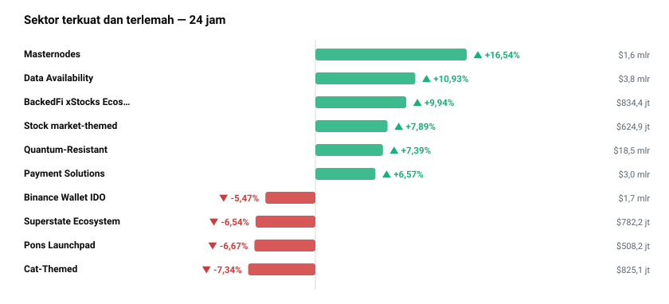
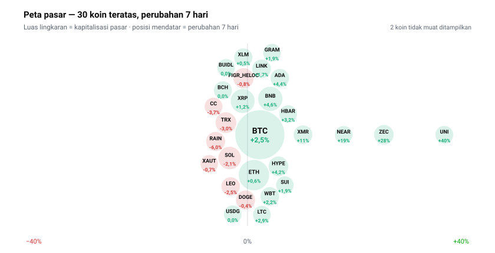

<!-- Dibuat otomatis oleh GitHub Actions pada 2026-09-05 07:51 WIB -->

# Briefing Harian — 5 September 2026

Disusun otomatis 07:51 WIB | 1 USD = Rp17.636 (Frankfurter)

## Yang Paling Penting Hari Ini
Rilis data *nonfarm payrolls* Amerika Serikat bulan Agustus yang jauh melampaui ekspektasi menjadi pemicu utama penekanan pasar hari ini, memukul harga Bitcoin kembali ke bawah level $80.000 ke posisi $79.609 (-1,86% dalam 24 jam). Angka tenaga kerja yang kuat ini memaksa pelaku pasar merevisi ke bawah probabilitas pemotongan suku bunga Federal Reserve bulan ini. Ketika narasi pelonggaran moneter tertahan, total kapitalisasi pasar crypto global tergerus 4,21% menjadi $2,70 triliun, mengesampingkan dinamika internal industri crypto dan menjadikan kebijakan ekonomi makro sebagai kemudi tunggal arah harga saat ini.

## Pasar Crypto

| Aset | Harga | 24 Jam | Kapitalisasi Pasar | Volume 24 Jam |
|---|---|---|---|---|
| BTC (Bitcoin) | $79.609 | -1,86% | $1,60 triliun | $34,9 miliar |
| ETH (Ethereum) | $2.453 | -2,03% | $299,3 miliar | $16,0 miliar |
| USDT (Tether) | $1,00 | +0,02% | $183,4 miliar | $66,1 miliar |
| BNB (BNB) | $719,82 | -0,65% | $95,9 miliar | $1,0 miliar |
| XRP (XRP) | $1,40 | -3,37% | $87,7 miliar | $2,9 miliar |
| USDC (USDC) | $1,00 | +0,01% | $74,6 miliar | $17,9 miliar |
| SOL (Solana) | $101,91 | -1,59% | $59,6 miliar | $3,3 miliar |
| TRX (TRON) | $0,3318 | +0,47% | $31,5 miliar | $401,3 juta |

Pergerakan terlemah di antara aset utama dialami oleh XRP (-3,37%) dan ETH (-2,03%), seiring tertekannya pasar secara luas akibat respons atas data ekonomi makro AS. Di sisi lain, aset berorientasi privasi di luar 8 teratas seperti Zcash (ZEC) mencatatkan lonjakan signifikan sebesar +8,57% dalam 24 jam ke posisi $1.022.

Dominasi Bitcoin saat ini berada di level 59,2% dengan Ethereum di posisi 11,1%. Tingginya dominasi BTC yang mendekati 60% menunjukkan bahwa likuiditas pasar masih terkonsentrasi pada aset berkapitalisasi terbesar, sehingga setiap penyesuaian harga BTC cenderung memberikan tekanan yang relatif lebih berat bagi mayoritas altcoin.

Total volume perdagangan pasar dalam 24 jam tercatat sebesar $97,4 miliar, di mana volume BTC menyumbang $34,9 miliar. Angka volume BTC tersebut setara dengan sekitar 2,18% dari kapitalisasi pasarnya — hitungan saya sendiri dari data harga di atas. Nilai ini mengindikasikan bahwa penurunan harga hari ini berlangsung dalam aktivitas transaksi normal dan belum menunjukkan tanda-tanda kepanikan (*sell-off* ekstrem); kalau volume terus menyusut saat harga terkoreksi, maka tekanan jual diperkirakan mereda.

## Sentimen Pasar

Indeks Fear & Greed berada di angka 73 (Greed) hari ini, sedikit bergeming dari 74 (Greed) kemarin, namun masih lebih tinggi dibanding posisi 68 (Greed) pada sepekan lalu.

Di saat indeks sentimen bertahan konsisten di area ketakutan yang rendah, pergerakan harga Bitcoin 7 hari terakhir menunjukkan dinamika yang berlawanan secara harian: BTC secara mingguan naik 1,77% dari $78.225 ke $79.610 setelah sempat menyentuh puncak $81.265 sebelum akhirnya terkoreksi harian akibat respons data ekonomi — hitungan saya sendiri dari deret harga harian CoinGecko.

Ketidaksesuaian antara sentimen yang tetap optimistis di level 73 dan koreksi harga harian melahirkan sinyal menarik. Pelaku pasar ritel tampak masih memegang optimisme tren mingguan, sehingga kejutan makro belum meruntuhkan ekspektasi jangka pendek mereka. kalau ketimpangan ini berlanjut tanpa perbaikan harga dalam beberapa hari ke depan, maka indeks berisiko mengalami penurunan tajam (*flush-out*) untuk menyesuaikan diri dengan realitas harga.

## Berita & Kebijakan Penting
* Data *nonfarm payrolls* AS bulan Agustus rilis jauh melampaui perkiraan, menekan Bitcoin turun ke bawah $80.000 karena pasar merevisi ekspektasi pemotongan suku bunga Federal Reserve bulan ini.
  Kenapa penting: Arah suku bunga Fed adalah penentu utama arus likuiditas global, dan tertahannya pemotongan suku bunga dapat membatasi masuknya modal baru ke aset berisiko.
* Regulator keuangan Korea Selatan meluncurkan peta jalan tiga tahap untuk penerbitan aset tertokenisasi guna mempersiapkan kerangka kerja *sekuritas tertokenisasi* pertama di negara tersebut.
  Kenapa penting: Kepastian regulasi di Korea Selatan membuka jalan resmi bagi institusi keuangan untuk membawa instrumen finansial tradisional ke atas rantai blok di salah satu pasar crypto terbesar Asia.
* Revolut dan OpenReserve menerima persetujuan awal dari OCC untuk mendirikan bank nasional Amerika Serikat dengan rencana menyediakan layanan crypto dan *stablecoin*.
  Kenapa penting: Persetujuan bank nasional AS memperkecil jarak antara perbankan tradisional dan aset digital, sekaligus memperluas infrastruktur adopsi *stablecoin*.
* Lembaga pembiayaan hipotek Pineapple Financial merencanakan pemindahan rekam data pinjaman senilai lebih dari $10 miliar ke atas rantai blok Injective.
  Kenapa penting: Inisiatif ini memperkuat integrasi *real-world assets* (RWA) secara nyata ke dalam ekosistem DeFi.
* FinCEN melaporkan bahwa jaringan kejahatan transnasional di Asia Tenggara bertanggung jawab atas penipuan crypto senilai $13 miliar yang menyasar warga Amerika Serikat.
  Kenapa penting: Temuan ini akan mendorong pengetatan regulasi antipencucian uang serta pengawasan ketat terhadap perantara finansial aset digital secara global.

## Rotasi Sektor

Sektor *Masternodes* mencatatkan kenaikan tertinggi sebesar +16,54% dalam 24 jam dengan total kapitalisasi $1,6 miliar, disusul sektor *Data Availability* (+10,93%, kapitalisasi $3,8 miliar) dan *BackedFi xStocks Ecosystem* (+9,94%, kapitalisasi $834,4 juta). Sementara itu, sektor *Cat-Themed* tertekan paling dalam sebesar -7,34% (kapitalisasi $825,1 juta), diikuti *Pons Launchpad* (-6,67%, kapitalisasi $508,2 juta).

Data ini memperlihatkan pergeseran modal keluar dari aset spekulatif bertema meme menuju sektor yang menawarkan utilitas teknis atau integrasi saham tertokenisasi saat kondisi makro memburuk.

## Yang Sedang Ramai Dibicarakan
Aset yang paling banyak dicari pada platform CoinGecko meliputi CLUSTER PROTOCOL (CP, peringkat #520), Pons (PONS, peringkat #111), Zcash (ZEC, peringkat #11), Lil' Shrub (SHRUB, peringkat #386), dan Lighter (LIT, peringkat #67). Sementara di forum diskusi Reddit r/CryptoCurrency, topik hangat berpusat pada kewajiban *penjembatanan* token Moons akibat pengurangan skala Arbitrum Nova, polemik laporan IMF mengenai tidak adanya dana publik El Salvador yang masuk ke Bitcoin sejak Juni 2025, serta kecemasan mengenai dampak komputer kuantum terhadap simpanan Bitcoin awal milik Satoshi.

Perlu ditekankan secara eksplisit bahwa tingginya sorotan dan volume percakapan ini murni merupakan indikator perhatian ritel semata, BUKAN indikator kualitas fundamental maupun jaminan keamanan aset.

## Kandidat untuk Diteliti

* **ZEC (Zcash)** — Menguat +27,50% dalam sepekan dan +98,80% dalam sebulan, mencerminkan tren naik yang kuat. Permintaan terhadap fitur privasi terdorong oleh sorotan teknis, sementara secara makro kenaikan sektor *Quantum-Resistant* (+7,39%) turut menopang pergerakannya.
* **DASH (Dash)** — Volume perdagangan 24 jam mencapai 60% dari kapitalisasi pasarnya ($826,0 juta) serta menguat +64,70% dalam sepekan. Pemicu mikronya belum diketahui dari data hari ini, tetapi lonjakan sektor *Masternodes* (+16,54%) menjadi penopang makro bagi kinerjanya.
* **LIT (Lighter)** — Mencatatkan lonjakan +38,10% dalam 7 hari dan +120,90% dalam 30 hari. Pemicu mikronya belum diketahui dari data hari ini, namun dorongan modal pada aset berkapitalisasi menengah di tengah koreksi BTC menjaga momentum pergerakannya.
* **UNI (Uniswap)** — Naik +39,70% dalam sepekan meski mengalami koreksi -2,61% dalam 24 jam sebagai bentuk konsolidasi. Penguatan mingguan ditopang oleh dominasi volume bursa terdesentralisasi, namun ketidakpastian makro membatasi laju kenaikan jangka pendeknya.
* **ARB (Arbitrum)** — Merekam kenaikan +50,00% dalam 7 hari kendati terkoreksi -9,41% hari ini. Pengumuman penyesuaian jaringan Arbitrum Nova menjadi pemicu mikro, sedangkan aksi ambil untung (*profit taking*) meluas akibat penyesuaian harga pasar crypto secara umum.

Ini hasil pemindaian angka, bukan rekomendasi. Sinyal di sini baru layak ditindaklanjuti setelah dibedah mendalam — suplai, unlock, pendana, dan whitepaper-nya.

## Sisi Lain
Pembacaan utama menekankan bahwa koreksi dipicu oleh tekanan data tenaga kerja AS terhadap ekspektasi pemotongan suku bunga Fed. Namun, argumen berlawanan menunjukkan bahwa penurunan BTC sebesar -1,86% setelah menyentuh puncak $81.265 sepekan ini sebenarnya hanya konsolidasi teknis yang wajar dalam tren naik bulanan (+1,77% dalam 7 hari). kalau arus modal ke sektor infrastruktur spesifik seperti *Masternodes* (+16,54%) dan *Data Availability* (+10,93%) terus bertahan, maka penurunan akibat faktor ekonomi makro ini berpotensi hanya menjadi koreksi sementara sebelum pasar melanjutkan akumulasi pada aset alternatif.

## Agenda yang Perlu Diperhatikan
* Rapat penetapan suku bunga Federal Reserve AS bulan ini (perkiraan) — fokus pasar pada re-ekspektasi pasca rilis *nonfarm payrolls*.
* Pelaksanaan tahap pertama peta jalan *sekuritas tertokenisasi* oleh regulator keuangan Korea Selatan (perkiraan).
* Keputusan final lisensi perbankan nasional AS bagi Revolut dan OpenReserve oleh OCC (perkiraan).
* Batas waktu *penjembatanan* token Moons seiring langkah efisiensi jaringan Arbitrum Nova oleh Arbitrum.

## Catatan & Batas Laporan Ini
Data rilis berita internasional BBC World dan pembaruan CryptoPanic tidak tersedia pada hari ini, sehingga laporan tidak dapat mengukur cakupan berita geopolitik global serta sentimen media sosial secara menyeluruh. Laporan ini juga tidak memuat jadwal pembukaan kunci token dan data pendanaan proyek, karena sumber gratisnya sudah tidak tersedia — keduanya perlu ditelusuri manual. Laporan ini menyajikan situasi, bukan nasihat investasi.
